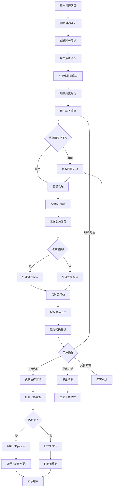

# AI聊天助手技术文档 (Technical Documentation)

## 📋 项目目录结构

```plaintext
油猴ai聊天插件/
├── AI_chat_assistant.user.js    # 主脚本文件 (4951行) - 包含所有功能模块
├── README.md                    # 项目说明文档
└── TECH_DOC.md                 # 技术文档 (本文件)
```

### 文件功能说明
- **AI_chat_assistant.user.js**: 单文件架构，包含完整的AI聊天助手功能
  - UserScript标头配置
  - CSS样式定义
  - 核心JavaScript逻辑
  - 所有功能模块集成

## 🔍 逐文件分析

### **文件路径**: `AI_chat_assistant.user.js`
**文件类型**: `JavaScript UserScript`
**核心职责**: AI聊天助手的完整实现，包括UI、API通信、代码执行、存储管理等

**依赖关系**:
- **导入外部库**:
  - `marked.min.js` - Markdown解析和渲染
  - `highlight.min.js` - 代码语法高亮
  - `pyodide.js` - 浏览器中的Python运行时
  - `agate.min.css` - 代码高亮主题样式
- **导出功能**: 无 (单文件自包含设计)
- **调用**: Greasemonkey/Tampermonkey API

**主要函数/类**:

#### 1. 核心配置管理
```javascript
// 函数: config 对象初始化
// 功能: 管理所有用户配置和应用状态
// 参数: 从GM存储加载的配置项
// 返回: 配置对象
// 逻辑: 使用GM_getValue从浏览器存储中加载配置，提供默认值
// 调用: 在脚本初始化时调用，贯穿整个应用生命周期
let config = {
    apiKey: GM_getValue('apiKey', ''),
    apiUrl: GM_getValue('apiUrl', 'https://XXX/v1/chat/completions'),
    model: GM_getValue('model', 'gpt-3.5'),
    // ... 其他配置项
};
```

#### 2. Pyodide Python环境管理
```javascript
// 函数: initializePyodide()
// 功能: 初始化浏览器中的Python运行环境
// 参数: 无
// 返回: Promise<boolean> - 初始化是否成功
// 逻辑: 
//   1. 检查loadPyodide可用性
//   2. 尝试多个CDN源加载Pyodide
//   3. 配置标准输入输出处理
//   4. 设置Python输入补丁
// 调用: 首次执行Python代码时懒加载
async function initializePyodide() {
    // CDN回退策略
    const cdnUrls = [
        "https://cdn.jsdelivr.net/pyodide/v0.26.0/full/",
        "https://cdn.staticfile.org/pyodide/0.26.0/full/",
        "https://cdnjs.cloudflare.com/ajax/libs/pyodide/0.26.0/full/"
    ];
    // 错误处理和重试逻辑
}
```

#### 3. 网页内容提取系统
```javascript
// 函数: getPageContent()
// 功能: 智能提取网页主要内容
// 参数: 无
// 返回: Object {url, title, content, charset, wordCount}
// 逻辑:
//   1. 优先使用自定义CSS选择器
//   2. 多策略查找主要内容区域
//   3. 清理广告、导航等无关元素
//   4. 文本预处理和长度限制
// 调用: 在开启网页上下文或总结功能时调用
function getPageContent() {
    // 自定义选择器处理
    if (config.customSelectors && config.customSelectors.trim()) {
        // 解析并应用CSS选择器
    }
    // 回退到默认策略
    let mainContent = findMainContent();
    // 内容清理和处理
}
```

#### 4. 流式响应处理核心
```javascript
// 函数: handleStreamResponse()
// 功能: 处理AI API的流式响应数据
// 参数: responseStream, aiMsgDiv, thinkingMsgDiv, isSummaryTask
// 返回: Promise<void>
// 逻辑:
//   1. 创建停止按钮和UI元素
//   2. 使用TextDecoder解码数据流
//   3. 解析SSE (Server-Sent Events) 格式
//   4. 分别处理思考内容和正式回答
//   5. 实时更新DOM和滚动位置
// 调用: 在发送消息且启用流式输出时调用
function handleStreamResponse(responseStream, aiMsgDiv, thinkingMsgDiv, isSummaryTask = false) {
    return new Promise((resolve, reject) => {
        // 创建停止机制
        let isStopped = false;
        // 设置TextDecoder和缓冲区
        const decoder = new TextDecoder();
        let buffer = '';
        // 逐行解析SSE数据
    });
}
```

#### 5. 代码执行系统
```javascript
// 函数: executeCode()
// 功能: 根据代码类型执行不同类型的代码
// 参数: code (代码字符串), lang (语言类型)
// 返回: Promise<void>
// 逻辑:
//   1. 检测代码语言类型
//   2. 为Python代码调用executePythonCode()
//   3. 为HTML代码调用executeHtmlCode()
//   4. 创建和管理执行弹窗
// 调用: 点击代码块的运行按钮时调用
async function executeCode(code, lang) {
    // 语言检测和分发
    if (lang === 'python') {
        executePythonCode(code, statusBar, sandbox);
    } else if (lang === 'html') {
        executeHtmlCode(code, statusBar, sandbox);
    }
}
```

#### 6. UI布局和交互管理
```javascript
// 函数: positionChatWindow()
// 功能: 智能计算并设置聊天窗口位置
// 参数: 无
// 返回: void
// 逻辑:
//   1. 获取图标当前位置
//   2. 计算可用屏幕空间
//   3. 优先右侧放置，空间不足时左侧
//   4. 垂直方向与图标对齐
//   5. 边界检查和安全回退
// 调用: 图标点击打开聊天窗口时调用
function positionChatWindow() {
    // 图标位置计算
    const iconRect = /* 复杂的位置计算逻辑 */;
    // 空间分析和位置决策
    // 边界限制和应用
}
```

#### 7. 消息发送和API通信
```javascript
// 函数: sendMessage()
// 功能: 发送消息到AI API并处理响应
// 参数: message, retryCount, isSummaryTask
// 返回: Promise<void>
// 逻辑:
//   1. 构建API请求数据
//   2. 添加网页上下文或系统提示
//   3. 使用GM_xmlhttpRequest发送请求
//   4. 处理流式/非流式响应
//   5. 错误处理和重试机制
// 调用: 用户发送消息或触发总结功能时调用
async function sendMessage(message, retryCount = 0, isSummaryTask = false) {
    // 请求数据构建
    const requestData = {
        model: config.model,
        messages: truncateContext(config.chatHistory, config.maxContextTokens),
        // ... 其他参数
    };
    // API调用和响应处理
}
```

#### 8. 数据存储和导出
```javascript
// 函数: 对话导出功能
// 功能: 将对话历史导出为多种格式
// 参数: 用户选择的格式
// 返回: void
// 逻辑:
//   1. 格式选择处理 (TXT/HTML/Markdown/JSON)
//   2. 数据序列化和格式化
//   3. 创建下载链接
//   4. 自动下载文件
// 调用: 点击导出按钮时调用
exportBtn.addEventListener('click', () => {
    // 格式处理和数据转换
    // 文件下载逻辑
});
```

## 🔄 核心交互流程图



## 🏗️ 技术架构说明

### 1. 架构设计模式
- **单文件架构**: 所有功能集成在一个文件中，便于部署和维护
- **事件驱动**: 基于DOM事件和用户交互驱动功能执行
- **模块化函数**: 功能拆分为独立函数，提高代码可维护性
- **异步编程**: 大量使用Promise和async/await处理异步操作

### 2. 核心技术栈
- **JavaScript ES6+**: 现代JavaScript特性
- **WebAssembly**: 通过Pyodide在浏览器中运行Python
- **Server-Sent Events**: 处理AI API的流式响应
- **DOM API**: 动态创建和管理UI元素
- **CSS3**: 现代样式和动画效果

### 3. 数据流架构
```
用户输入 → 预处理 → API请求 → 流式解析 → DOM更新 → 存储保存
    ↑                                                      ↓
配置管理 ← ← ← ← ← ← ← ← ← ← ← ← ← ← ← ← ← ← ← ← ← ← ← ← 历史记录
```

### 4. 存储策略
- **配置存储**: 使用GM_setValue/GM_getValue持久化用户配置
- **历史记录**: 分为chatHistory(显示用)和fullConversation(完整数据)
- **临时状态**: 使用JavaScript变量管理运行时状态

## 🚀 关键设计决策

### 1. 单文件架构选择
**优点**: 
- 部署简单，用户只需安装一个文件
- 避免模块依赖问题
- 适合用户脚本的分发模式

**缺点**:
- 文件较大，可维护性相对较低
- 功能模块间耦合较高

### 2. 懒加载Pyodide
**原因**: Pyodide体积较大(约20MB)，懒加载可以：
- 减少初始化时间
- 节省不需要代码执行功能用户的带宽
- 提供更好的用户体验

### 3. 流式响应设计
**技术实现**:
- 使用GM_xmlhttpRequest的stream response type
- TextDecoder处理字节流
- SSE格式解析

**用户体验优势**:
- 实时显示AI思考过程
- 降低等待时间的感知
- 支持中途停止响应

### 4. 双层对话存储
**设计理念**:
- `chatHistory`: 简化版本，用于显示和API发送
- `fullConversation`: 完整版本，包含时间戳、推理内容等元数据

**优势**:
- 灵活的显示控制
- 完整的数据保存
- 支持高级导出功能

## 🔧 待办事项扫描

基于代码分析，发现以下TODO/FIXME项目:

### 高优先级
1. **错误处理增强**: 当前某些异常情况的错误处理不够完善
2. **内存管理**: Python代码执行可能导致内存泄露
3. **API限流**: 缺少请求频率限制机制

### 中优先级
1. **性能优化**: 大型对话历史的渲染性能
2. **国际化**: 界面文字硬编码，需要支持多语言
3. **插件系统**: 考虑支持第三方功能扩展

### 低优先级
1. **主题系统**: 更丰富的界面主题选择
2. **快捷键**: 支持键盘快捷键操作
3. **移动端适配**: 优化移动设备上的用户体验

## 🔍 代码质量分析

### 优点
- **功能完整**: 涵盖AI对话、代码执行、内容提取等多个功能
- **用户体验**: 良好的交互设计和视觉效果
- **错误恢复**: 多重错误处理和回退机制
- **配置灵活**: 丰富的自定义配置选项

### 改进建议
- **代码拆分**: 考虑将大函数拆分为更小的模块
- **注释完善**: 部分复杂逻辑缺少详细注释
- **类型检查**: 考虑使用TypeScript提高代码健壮性
- **单元测试**: 缺少自动化测试覆盖

## 📊 性能考量

### 内存使用
- **Pyodide环境**: 约50-100MB内存占用
- **对话历史**: 根据对话长度动态增长
- **DOM元素**: 动态创建的UI元素需要及时清理

### 网络优化
- **CDN回退**: 多个Pyodide CDN源提高加载成功率
- **流式响应**: 减少首字节时间
- **错误重试**: 智能重试机制提高成功率

### 渲染性能
- **虚拟滚动**: 大量历史消息时考虑使用虚拟滚动
- **防抖处理**: 用户输入和滚动事件的防抖
- **GPU加速**: 动画和过渡使用transform3d启用GPU加速

---

**技术文档版本**: v1.0  
**文档更新时间**: 2025年1月  
**兼容性**: 支持现代浏览器和Tampermonkey/Greasemonkey环境 